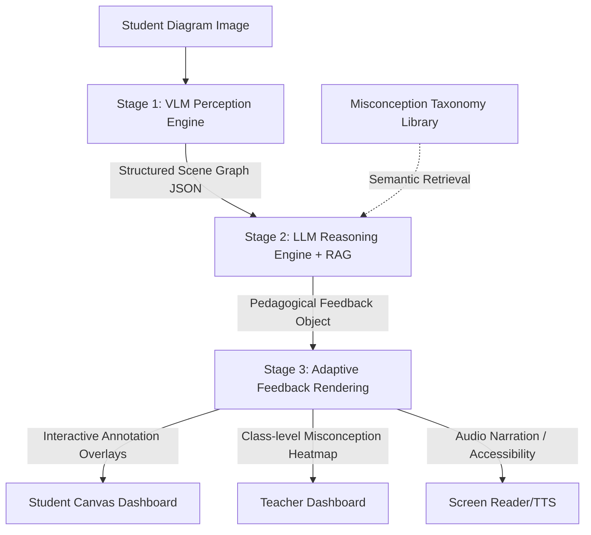

 # Multimodal AI STEM Diagram Feedback System - Implementation Plan

This project implements a three-stage pipeline to evaluate student STEM diagrams and provide Socratic, formative feedback locally or via open cloud endpoints (Ollama/NVIDIA NIM).

## Proposed Architecture & Components



### Proposed Code Directory Structure

```
├── backend/
│   ├── __init__.py
│   ├── stage1_perception.py   # VLM spatial elements & scene graph extraction
│   ├── stage2_reasoning.py    # LLM misconception mapping, RAG library & Socratic engine
│   ├── stage3_rendering.py    # Overlay coordinate mapping & audio rendering helpers
│   ├── data_pipeline.py       # AI2D and FigureQA dataset fetcher & formatting
│   ├── train_lora.py          # PEFT/LoRA training logic
│   ├── evaluate.py            # Evaluation metrics (GED, F1, Learning Gain, Latency)
│   ├── stats_analysis.py      # Statistical power analysis & hypothesis testing (Python)
│   ├── stats_analysis.R       # Statistical power analysis & hypothesis testing (R)
│   └── main.py                # FastAPI web server serving static files & processing API
├── frontend/
│   ├── index.html             # HTML5 Dashboard (Student & Teacher view, canvas, charts)
│   ├── styles.css             # Glassmorphism, animations, dark mode style system
│   └── app.js                 # Canvas interactive overlay, state, & FastAPI client integrations
├── training_config.yaml       # Hugging Face training config
├── fine_tune_pipeline.ipynb   # Jupyter Notebook showing pipeline and training
└── run.py                     # Entry point to launch the web dashboard
```

---

## Technical Specifications & Code Components

### 1. Stage 1: VLM Perception Engine (`backend/stage1_perception.py`)
- Extracts boxes/polygons of labels, forces, symbols, and directions.
- Grounding: Separates biology arrows (flow/cycle) from physics arrows (force vectors).
- Scene Graph: Generates a JSON list of nodes and directional relations, including confidence scores.

### 2. Stage 2: LLM Reasoning Engine & RAG (`backend/stage2_reasoning.py`)
- Integrates a local vector store (using `Chroma` or a lightweight matrix-based similarity lookup on top of SentenceTransformers) over the misconception taxomy libraries (AAAS Project 2061 schema & MaLT Error Library).
- Generates Socratic feedback prompting students to reason through errors rather than telling them answers directly.

### 3. Stage 3: Rendering & Accessibility (`backend/stage3_rendering.py`)
- Maps normalized bounding boxes to viewport coordinates for HTML5 Canvas overlays.
- Provides text-to-speech narration scripts.

### 4. Data Processing & Fine-tuning (`backend/data_pipeline.py`, `backend/train_lora.py`, `training_config.yaml`)
- Code to download and convert Hugging Face `lmms-lab/ai2d` and `FigureQA` into VQA text/image datasets.
- Fine-tuning config with 8-bit AdamW, cosine schedule, and peft `LoraConfig`.

### 5. Evaluation & Statistics (`backend/evaluate.py`, `backend/stats_analysis.py`, `backend/stats_analysis.R`)
- Computes F1 score for classification, Graph Edit Distance (GED) for scene graphs, and Learning Gain.
- Implements stats power calculations (Cohen's d=0.30, alpha=0.05, 80% power) and pre/post-test comparative T-tests.

### 6. Interactive Web Dashboard (`frontend/index.html`, `frontend/styles.css`, `frontend/app.js`)
- **Student Console**: Drawing upload, interactive annotation overlays, misconception log, Socratic chatbot conversation history, audio feedback.
- **Teacher Console**: Real-time misconception distribution heatmap, longitudinal student success rates, and RAG library explorer.

---

## Verification Plan

### Automated Verification
- Verify Python files syntax and execution:
  - Run checks on `data_pipeline.py`, `evaluate.py`, and `stats_analysis.py` to confirm zero exceptions.
- Verify FastAPI startup and frontend loading:
  - Spawn the FastAPI server in the background and confirm static paths load correctly.

### Manual Verification
- View and test the web frontend UI:
  - Upload sample diagrams (Physics Free-Body Diagram, Biology Water Cycle, Chemistry Lewis Dot).
  - Interact with overlays to view coordinate boxes and Socratic prompts.
  - Review the heatmaps in the teacher view.
  - Click on accessibility mode to trigger narration text.
